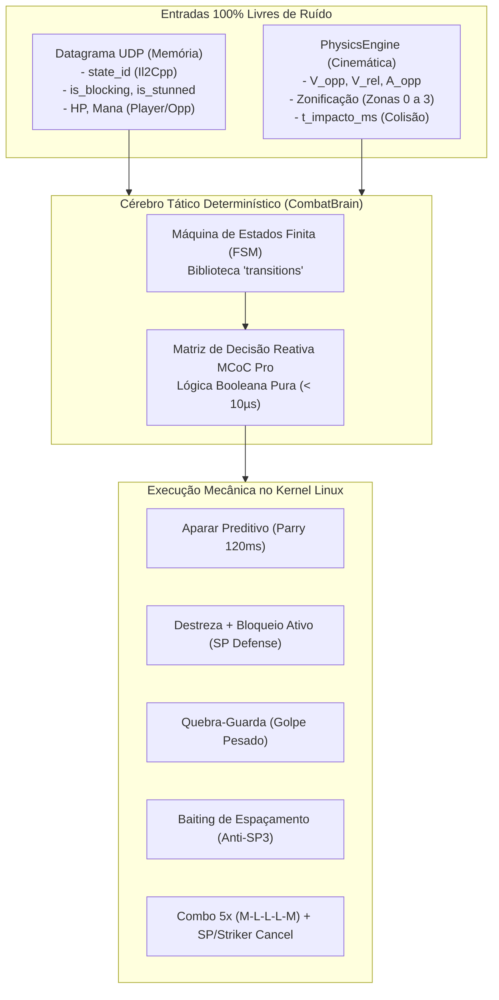
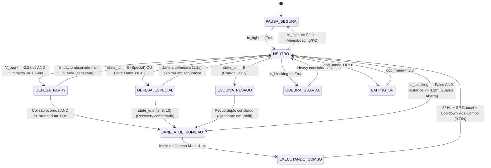
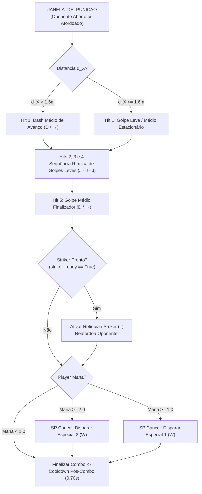

# 🧠 Especificação Técnica: Cérebro Tático Determinístico (`CombatBrain`)

> **Documento:** Especificação Técnica da Máquina de Estados Finita e Regras de Decisão  
> **Projeto:** NovoAuto (MCoC Zero-Vision Bot)  
> **Módulo:** `brain/combat_fsm.py` & `brain/rules.py`  
> **Entradas:** `TelemetryPacket` (Memória UDP) + `KinematicSnapshot` (Física Vetorial)  
> **Saídas:** Comandos Mecânicos para o `VirtualDevice` e `ComboSequencer`  
> **Tempo de Decisão Médio:** **$< 10$ microssegundos** por ciclo  

---

## 1. 🎯 Filosofia do Determinismo de Combate

No projeto anterior (com visão computacional), a tomada de decisão precisava conviver com a **incerteza heurística**: probabilidades de template matching, tolerâncias de cor HSV, atrasos de captura de tela e falsos positivos causados por fumaça ou animações de fundo.

No **NovoAuto**, o `CombatBrain` opera sob **determinismo absoluto**:
1. O **Datagrama UDP** fornece estados binários e discretos diretamente da memória do jogo (`is_blocking`, `is_stunned`, IDs de animação Il2Cpp, HP e Mana precisos).
2. O **Motor de Cinemática** (`PhysicsEngine`) fornece grandezas escalares exatas ($V_{\text{opp}}$, $V_{\text{rel}}$, $A_{\text{opp}}$, zonificação 3D e tempo predito de impacto $t_{\text{impacto}}$).



---

## 2. 🗺️ Diagrama de Estados Finitos (FSM)

A arquitetura formal é governada pela biblioteca `transitions`, garantindo que nenhuma ação ilegal ocorra fora do estado apropriado.



---

## 3. 📊 Matriz de Decisão Reativa e Tabela da Verdade

Esta matriz mapeia de forma exaustiva o estado do jogo para a contra-ação ótima adotada por jogadores profissionais no MCoC:

| Estado Il2Cpp (`state_id`) | Cinemática (`action`) | Zona Espacial | Condição de Recursos / Flags | Estado Alvo da FSM | Contra-Ação Mecânica Emitida |
| :--- | :--- | :--- | :--- | :--- | :--- |
| **`2: Run` / `4: Attack`** | `DASH_FORWARD` | Zona 1 ($1.6\text{m} - 2.8\text{m}$) | $90\text{ms} \le t_{\text{impacto}} \le 135\text{ms}$ | `DEFESA_PARRY` | Emite pulso cirúrgico de Bloqueio de **120ms** (`parry_pulse`). |
| **`8: Stun`** | Qualquer | Zona 0 ou Zona 1 | `is_stunned == True` | `JANELA_DE_PUNICAO` | Aciona combo de 5 acertos (`M-L-L-L-M`) + cancelamento em Especial. |
| **`9: Special`** | Qualquer | Qualquer | `opp_mana >= 1.0` ou $\Delta\text{Mana} \le -0.8$ | `DEFESA_ESPECIAL` | Recuo duplo (`double_dash_back`), guarda firme por 1.2s até `Recovery`. |
| **`10: SpecialReaction`**| `RECOVERY` | Qualquer | Janela de especial do oponente encerrada | `JANELA_DE_PUNICAO` | Solta o bloqueio e avança imediatamente para contra-atacar o *whiff*. |
| **`5: ChargeHeavy`** | `HEAVY_WINDUP` | Zona 0 ou Zona 1 | Oponente armando golpe pesado | `ESQUIVA_PESADO` | Recuo duplo imediato (`double_dash_back`), aguarda o golpe errar e pune. |
| **`1: Block`** | `STATIC_BLOCK` | Zona 0 ($d \le 1.6\text{m}$) | `is_blocking == True` | `QUEBRA_GUARDA` | Carrega e solta o **Ataque Pesado no local** (`hold_heavy`). |
| **`1: Block`** | `STATIC_BLOCK` | Zona 1 ($1.6\text{m} < d \le 2.8\text{m}$) | `is_blocking == True` (3+ ticks) | `QUEBRA_GUARDA` | Avança com **Dash Médio $\rightarrow$ Ataque Pesado** imediatamente. |
| **Qualquer** | Qualquer | Zona 2 ($2.8\text{m} - 4.0\text{m}$) | `opp_mana >= 2.8` (Risco SP3) | `BAITING_SP` | Mantém distância, toque breve de guarda e recuo para forçar SP1/SP2. |
| **`0: Idle`** | `NEUTRAL` | Zona 0 ($d \le 1.6\text{m}$) | Ambos em repouso estático | `NEUTRO` | Finta tática de espaçamento (recuo rápido de 1 passo) para atrair avanço. |
| **`0: Idle`** | `NEUTRAL` | Zona 1 ($1.6\text{m} < d \le 2.8\text{m}$) | Oponente passivo em guarda aberta | `JANELA_DE_PUNICAO` | Iniciativa ofensiva com Dash Médio abrindo combo de 5 acertos. |
| **Qualquer** | Qualquer | Qualquer | Queda súbita de vida ($\Delta\text{HP}_{\text{player}} \ge 1.8\%$) | `DEFESA_EMERGENCIA` | Ergue Bloqueio de Emergência imediato por 420ms para travar combo inimigo. |
| **Qualquer** | Qualquer | Qualquer | `in_fight == False` (Menus, vitória, KO) | `PAUSA_SEGURA` | Parada de emergência no kernel (`release_all`), zero consumo de CPU. |

---

## 4. ⚙️ Detalhamento Rigoroso das Regras Táticas

### 4.1. Regra 1: Aparar Perfeito Preditivo (Predictive Parry)
* **Objetivo:** Aplicar atordoamento no primeiro frame de impacto físico do oponente.
* **Mecânica:**
  1. O motor de cinemática detecta $V_{X,\text{opp}} \le -2.2\text{ m/s}$ (ou `state_id == 2 Run`).
  2. O preditor calcula $t_{\text{impacto}} = \frac{d_X - d_{\text{contato}}}{|V_{\text{rel}}|}$.
  3. No instante em que $t_{\text{impacto}} \le 135\text{ ms}$, a FSM entra em `DEFESA_PARRY` e dispara `virtual_device.parry_pulse(duration_ms=120)`.
  4. Ao término do pulso, verifica `is_opponent_stunned == True`:
     * Se confirmado atordoamento $\rightarrow$ Transita imediatamente para `JANELA_DE_PUNICAO`.
     * Se o oponente não atordoou (ex: golpe inbloqueável) $\rightarrow$ Recua com Dash Back para segurança.

---

### 4.2. Regra 2: Defesa Ativa e Destreza contra Ataques Especiais (Anti-Suicídio)
* **Objetivo:** Sobreviver a especiais de múltiplos acertos e projéteis longos sem avançar prematuramente.
* **O Problema Resolvido:** Ataques especiais no MCoC duram múltiplos frames ativos (feixes de energia, disparos, sequências de socos). Bots comuns esquivam do primeiro golpe e avançam imediatamente, colidindo contra o restante do ataque especial e morrendo.
* **Mecânica do NovoAuto:**
  1. O gatilho de disparo é reconhecido por **dupla confirmação**: `state_id == 9` (`FinalSpecialAttack`) OU queda de mana do adversário $\Delta\text{Mana} \le -0.8$.
  2. A FSM transita para `DEFESA_ESPECIAL`.
  3. O bot executa recuo duplo (`double_dash_back()`) ativando o bônus de **Destreza (Dexterity)** para evadir o primeiro projétil.
  4. Em seguida, ergue e sustenta o bloqueio ativo (`engage_block()`) com proteção temporizada por **1.2 segundos** (`special_defense_until = now + 1.2s`).
  5. **Critério Estrito de Liberação de Punição:**
     * O bot **permanece defendendo** até que o oponente entre comprovadamente em recuperação de animação:
       `opp_state_id in (6, 8, 10)` (`HitReact`, `Stun`, `FinalSpecialAttackReaction`) OU a janela de 1.2s expire com o oponente em `Idle`.
     * Apenas quando a vulnerabilidade é confirmada, o bot solta o bloqueio (`release_block()`) e transita para `JANELA_DE_PUNICAO`.

---

### 4.3. Regra 3: Quebra-Guarda com Ataque Pesado (Heavy Shield Break)
* **Objetivo:** Punir oponentes que permanecem em bloqueio passivo (*turtle*).
* **Mecânica:**
  1. A flag `is_opponent_blocking == True` (leitura de `_blocksRequestedFlags != 0` da RAM) identifica que a IA está segurando defesa.
  2. **Caso Corpo a Corpo ($d_X \le 1.60\text{m}$):**
     * Dispara diretamente a carga de Golpe Pesado (`hold_heavy(duration_ms=450)`). O golpe quebra a guarda do oponente, derrubando-o no chão.
  3. **Caso Média Distância ($1.60\text{m} < d_X \le 2.80\text{m}$):**
     * Executa aproximação com Dash Médio (`D` / `→`), aguarda $40\text{ms}$ para desaceleração e engatilha o Ataque Pesado imediatamente.
  4. Após o impacto, o bot recua com Dash Back para restabelecer neutro.

---

### 4.4. Regra 4: Baiting e Gestão Preventiva contra SP3 Fatal
* **Objetivo:** Impedir que o adversário acumule 3 barras de especial cheias (o SP3 da IA no MCoC é indefensável e ativa cutscene de dano crítico/mortal).
* **Mecânica:**
  1. Monitora continuamente `opponent.mana`.
  2. No momento em que `opponent.mana >= 2.80` (aproximando-se do nível 3), a FSM ativa `BAITING_SP`.
  3. O bot se posiciona na Zona 2 ($d \in [2.8\text{m}, 4.0\text{m}]$), fora do alcance de golpes normais.
  4. Alterna toques rápidos de guarda (bloqueio de 80ms) intercalados com recuo suave (`dash_back()`).
  5. Essa postura de finta induz a árvore de decisão da IA do jogo a descarregar o SP1 ou SP2 defensivo, esvaziando a barra de mana para níveis seguros.

---

### 4.5. Regra 5: Guarda de Emergência por Impacto de Dano
* **Objetivo:** Proteger o campeão caso ele sofra um golpe inesperado, evitando ser encaixado em um combo completo de 5 acertos da IA.
* **Mecânica:**
  1. Compara a vida atual com o frame anterior: $\Delta\text{HP} = \text{HP}_{\text{anterior}} - \text{HP}_{\text{atual}}$.
  2. Se $\Delta\text{HP} \ge 1.8\%$, o cérebro reconhece que o jogador sofreu impacto de dano real.
  3. Trava imediatamente em bloqueio de emergência (`engage_block()`) sustentado por **420ms** para absorver os golpes subsequentes do combo do adversário.
  4. Assim que a pressão cessa, solta o bloqueio e recua com Dash Back para reiniciar o combate a distância segura.

---

### 4.6. Regra 6: Disciplina Pós-Combo (Anti-Whiff / Wake-Up Protection)
* **Objetivo:** Impedir socos no ar ou interceptações da IA durante a animação de levantada (*wake-up*) do oponente.
* **Mecânica:**
  1. Ao concluir uma sequência de ataque ou golpe pesado, o bot registra `last_combo_end_time = now`.
  2. Ativa uma janela de cooldown estrito de **0.70 segundos** (`post_combo_cooldown_sec`).
  3. Durante essa janela:
     * O oponente caído no chão está com frames de invulnerabilidade. O bot **não avança** e permanece em neutro disciplinado.
     * **Exceção Reativa:** Se o oponente levantar descarregando um Especial, o bot reage imediatamente com Destreza; se o oponente levantar em Dash agressivo, o bot aplica Aparar.

---

## 5. ⚔️ Orquestração da Cadeia Ofensiva (`ComboSequencer`)

Quando o estado transita para `JANELA_DE_PUNICAO`, o cérebro consulta a árvore de maximização de dano:



* **Eliminação do Bug do Double-Dash:** O avanço inicial é delegado exclusivamente ao primeiro hit do sequenciador. A FSM apenas comuta o estado para `JANELA_DE_PUNICAO`, garantindo que o ciclo `M-L-L-L-M` execute com cadência matemática perfeita sem colisões de comandos repetidos.

---

## 6. 🐍 Implementação Completa em Python (`brain/combat_fsm.py`)

Abaixo está o código-fonte de referência da máquina de estados tática determinística do **NovoAuto**:

```python
"""
NovoAuto - Cérebro Tático Determinístico (CombatBrain)
Máquina de Estados Finita e Matriz de Decisão Baseada em Memória e Cinemática.
Tempo de ciclo: < 10 microssegundos.
"""

import time
import logging
from typing import Optional
from transitions import Machine

from physics.kinematics import KinematicSnapshot, PhysicalAction, CombatRangeZone

logger = logging.getLogger("NovoAuto.CombatBrain")

class CombatBrain:
    """
    Controlador de decisão formal do NovoAuto.
    Consome KinematicSnapshot e TelemetryPacket e emite comandos de combate.
    """
    STATES = [
        "PAUSA_SEGURA",
        "NEUTRO",
        "DEFESA_PARRY",
        "DEFESA_ESPECIAL",
        "ESQUIVA_PESADO",
        "QUEBRA_GUARDA",
        "BAITING_SP",
        "JANELA_DE_PUNICAO",
        "EXECUTANDO_COMBO"
    ]

    def __init__(self, virtual_device, combo_sequencer):
        self.device = virtual_device
        self.combo = combo_sequencer

        # Variáveis de Controle e Janelas Temporais
        self.last_player_hp: float = 100.0
        self.is_holding_guard: bool = False
        self.damage_taken_time: float = 0.0
        self.special_defense_until: float = 0.0
        self.last_combo_end_time: float = 0.0
        self.post_combo_cooldown_sec: float = 0.70
        self.last_spacing_time: float = 0.0
        self.prev_opp_mana: float = 0.0

        # Criação da Máquina de Estados Finita via transitions
        self.machine = Machine(
            model=self,
            states=CombatBrain.STATES,
            initial="PAUSA_SEGURA",
            auto_transitions=False,
        )
        self._setup_transitions()

    def _setup_transitions(self) -> None:
        # Transições para Defesa
        self.machine.add_transition("trigger_parry", ["NEUTRO", "BAITING_SP"], "DEFESA_PARRY", after="on_enter_parry")
        self.machine.add_transition("trigger_special_defense", ["NEUTRO", "BAITING_SP", "DEFESA_PARRY"], "DEFESA_ESPECIAL", after="on_enter_special_defense")
        self.machine.add_transition("trigger_heavy_evade", ["NEUTRO", "BAITING_SP"], "ESQUIVA_PESADO", after="on_enter_heavy_evade")
        self.machine.add_transition("trigger_guard_break", ["NEUTRO", "JANELA_DE_PUNICAO"], "QUEBRA_GUARDA", after="on_enter_guard_break")
        self.machine.add_transition("trigger_baiting", "NEUTRO", "BAITING_SP", after="on_enter_baiting")
        
        # Transições Ofensivas
        self.machine.add_transition("trigger_punish", ["NEUTRO", "DEFESA_PARRY", "DEFESA_ESPECIAL", "ESQUIVA_PESADO", "BAITING_SP"], "JANELA_DE_PUNICAO", after="on_enter_punish")
        self.machine.add_transition("trigger_combo_start", "JANELA_DE_PUNICAO", "EXECUTANDO_COMBO", after="on_enter_combo")
        
        # Retornos e Segurança
        self.machine.add_transition("return_neutral", ["DEFESA_PARRY", "DEFESA_ESPECIAL", "ESQUIVA_PESADO", "QUEBRA_GUARDA", "BAITING_SP", "JANELA_DE_PUNICAO", "EXECUTANDO_COMBO", "PAUSA_SEGURA"], "NEUTRO", after="on_enter_neutral")
        self.machine.add_transition("trigger_safety_pause", "*", "PAUSA_SEGURA", after="on_enter_safety_pause")

    def update(self, packet, physics: KinematicSnapshot) -> None:
        """
        Ciclo principal de avaliação de regras táticas (< 10 microssegundos).
        Chamado a cada novo pacote de telemetria recebido.
        """
        now = time.perf_counter()

        # ----------------------------------------------------------------------
        # Regra 0: Validação de Combate Ativo no Jogo
        # ----------------------------------------------------------------------
        if not packet.in_fight:
            if self.state != "PAUSA_SEGURA":
                self.trigger_safety_pause()
            return
        elif self.state == "PAUSA_SEGURA":
            self.last_player_hp = packet.player.hp_pct
            self.return_neutral()
            return

        # Durante a execução física de combo, isola o fluxo de decisões
        if self.state == "EXECUTANDO_COMBO":
            return

        # ----------------------------------------------------------------------
        # Regra de Sobrevivência: Guarda de Emergência por Dano
        # ----------------------------------------------------------------------
        hp_drop = self.last_player_hp - packet.player.hp_pct
        if hp_drop >= 1.8:
            self.last_player_hp = packet.player.hp_pct
            self.damage_taken_time = now
            self.is_holding_guard = True
            self.device.engage_block()
            logger.warning(f"[Dano] Queda de HP de {hp_drop:.1f}%! Erguendo BLOQUEIO DE EMERGÊNCIA!")
            return

        if self.is_holding_guard and self.special_defense_until == 0.0 and self.damage_taken_time > 0:
            if (now - self.damage_taken_time) < 0.42:
                return  # Sustenta bloqueio para absorver combo adversário
            else:
                self.device.release_block()
                self.device.dash_back()
                self.is_holding_guard = False
                self.damage_taken_time = 0.0
                self.return_neutral()
                return

        self.last_player_hp = packet.player.hp_pct

        # ----------------------------------------------------------------------
        # Disciplina Pós-Combo (Anti-Whiff / Wake-up)
        # ----------------------------------------------------------------------
        if (now - self.last_combo_end_time) < self.post_combo_cooldown_sec and self.state == "NEUTRO":
            # Reage apenas se o oponente acordar com Especial ou Dash
            if packet.opp_state_id == 9 or (self.prev_opp_mana - packet.opponent.mana >= 0.8):
                self._handle_special_trigger(now)
            elif physics.action == PhysicalAction.DASH_FORWARD:
                self.device.parry_pulse()
            self.prev_opp_mana = packet.opponent.mana
            return

        # ----------------------------------------------------------------------
        # 1. Alerta e Reação a Ataque Especial Inimigo (SP1 / SP2)
        # ----------------------------------------------------------------------
        is_special_firing = (
            packet.opp_state_id == 9 or
            (self.prev_opp_mana >= 1.0 and (self.prev_opp_mana - packet.opponent.mana) >= 0.8)
        )
        self.prev_opp_mana = packet.opponent.mana

        if is_special_firing:
            self._handle_special_trigger(now)
            return

        # Sustentação Defensiva durante Especial Inimigo
        if self.is_holding_guard and self.special_defense_until > 0:
            if packet.opp_state_id in (6, 8, 10) or packet.opponent.is_stunned:
                # Fim do especial confirmado em recuperação!
                self.device.release_block()
                self.is_holding_guard = False
                self.special_defense_until = 0.0
                self.trigger_punish()
                return
            elif now < self.special_defense_until:
                return  # Continua absorvendo projéteis
            else:
                self.device.release_block()
                self.is_holding_guard = False
                self.special_defense_until = 0.0
                self.return_neutral()
                return

        # ----------------------------------------------------------------------
        # 2. Oponente Atordoado (Stun de Parry ou Relíquia) -> Punição Imediata
        # ----------------------------------------------------------------------
        if packet.opponent.is_stunned or packet.opp_state_id == 8:
            if self.state in ["NEUTRO", "DEFESA_PARRY", "BAITING_SP"]:
                self.trigger_punish()
                return

        # ----------------------------------------------------------------------
        # 3. Oponente Carregando Golpe Pesado (Heavy Wind-up) -> Esquiva
        # ----------------------------------------------------------------------
        if packet.opp_state_id == 5:
            if self.state in ["NEUTRO", "BAITING_SP"]:
                self.trigger_heavy_evade()
                return

        # ----------------------------------------------------------------------
        # 4. Oponente Avançando em Dash Forward -> Aparar Preditivo (Parry)
        # ----------------------------------------------------------------------
        if physics.action == PhysicalAction.DASH_FORWARD:
            if 90.0 <= physics.t_impact_ms <= 135.0 or packet.opp_state_id == 2:
                if self.state in ["NEUTRO", "BAITING_SP"]:
                    self.trigger_parry()
                    return

        # ----------------------------------------------------------------------
        # 5. Oponente Bloqueando -> Ataque Pesado (Quebra-Guarda)
        # ----------------------------------------------------------------------
        if packet.opponent.is_blocking or packet.opp_state_id == 1:
            if self.state in ["NEUTRO", "JANELA_DE_PUNICAO"]:
                self.trigger_guard_break()
                return

        # ----------------------------------------------------------------------
        # 6. Risco de SP3 (Oponente com 2.8+ Barras) -> Baiting Preventivo
        # ----------------------------------------------------------------------
        if packet.opponent.mana >= 2.8:
            if self.state == "NEUTRO":
                self.trigger_baiting()
                return
        elif self.state == "BAITING_SP":
            self.return_neutral()

        # ----------------------------------------------------------------------
        # 7. Oponente em Guarda Aberta ou Neutro -> Iniciativa Ofensiva
        # ----------------------------------------------------------------------
        if not packet.opponent.is_blocking and physics.zone in (CombatRangeZone.CLOSE_INFIGHT, CombatRangeZone.DASH_PUNISH):
            if self.state == "NEUTRO":
                self.trigger_punish()
                return

    # Callbacks de Estados
    def on_enter_parry(self):
        logger.info("[CombatBrain] Executando APARAR PREDITIVO (Parry 120ms)...")
        self.device.parry_pulse(120)

    def on_enter_special_defense(self):
        logger.info("[CombatBrain] Especial inimigo detectado! Executando DESTREZA e Bloqueio Ativo por 1.2s...")
        self.device.double_dash_back()
        self.device.engage_block()
        self.is_holding_guard = True
        self.special_defense_until = time.perf_counter() + 1.20

    def on_enter_heavy_evade(self):
        logger.info("[CombatBrain] Heavy Wind-up detectado! Executando ESQUIVA DUPLA...")
        self.device.double_dash_back()
        time.sleep(0.18)
        self.trigger_punish()

    def on_enter_guard_break(self):
        logger.info("[CombatBrain] Oponente bloqueando! Executando ATAQUE PESADO (Quebra-Guarda)...")
        self.device.hold_heavy(420)
        time.sleep(0.10)
        self.device.dash_back()
        self.last_combo_end_time = time.perf_counter()
        self.return_neutral()

    def on_enter_baiting(self):
        logger.info("[CombatBrain] Risco de SP3! Iniciando BAITING de Especial...")
        self.device.engage_block()
        time.sleep(0.08)
        self.device.release_block()
        self.device.dash_back()

    def on_enter_punish(self):
        logger.info("[CombatBrain] Janela de punição aberta! Disparando Combo Sequencer...")
        self.trigger_combo_start()
        # Executa combo padrão 5 hits (M-L-L-L-M) com SP Cancel
        self.combo.run_punish_combo()
        self.last_combo_end_time = time.perf_counter()
        self.return_neutral()

    def on_enter_safety_pause(self):
        logger.warning("[CombatBrain] Combate inativo. Parada de emergência no kernel.")
        self.is_holding_guard = False
        self.device.emergency_stop()

    def on_enter_neutral(self):
        pass

    def _handle_special_trigger(self, now: float):
        if self.state != "DEFESA_ESPECIAL":
            try:
                self.trigger_special_defense()
            except Exception:
                pass
```

---

## 7. 🧪 Cobertura de Testes Automatizados da FSM

O módulo é validado por suíte de testes unitários que simula cada transição e exceção:

1. **`test_parry_predictive_trigger`:** Valida que aproximação em alta velocidade dispara pulso de bloqueio na janela de $90\text{ms}-135\text{ms}$.
2. **`test_special_defense_multi_hit_hold`:** Valida que a guarda não é solta prematuramente no primeiro frame do especial, permanecendo erguida até `Recovery`.
3. **`test_guard_break_on_blocking`:** Valida que `is_blocking == True` aciona quebra-guarda com ataque pesado.
4. **`test_anti_sp3_baiting`:** Valida que $2.8+$ barras de mana do oponente ativa o recuo e fintas táticas.
5. **`test_post_combo_wake_up_cooldown`:** Valida que o bot recusa inputs agressivos nos $700\text{ms}$ pós-combo enquanto o oponente se levanta do chão.
