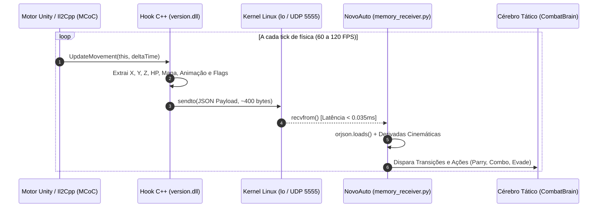

# 📡 Especificação Técnica Completa: Datagrama UDP de Telemetria (NovoAuto)

> **Documento:** Especificação Técnica do Protocolo e Datagrama UDP  
> **Projeto:** NovoAuto (MCoC Zero-Vision Bot)  
> **Origem dos Dados:** Hook C++ em Il2Cpp (`UltimatePlayerController_UpdateMovement` / `dPresent`) via `version.dll`  
> **Destino:** Receptor Assíncrono Python (`memory_receiver.py`)  
> **Canal:** `127.0.0.1:5555` (Loopback Local IPv4 / UDP)  

---

## 1. 🌐 Visão Geral do Canal de Telemetria

O datagrama UDP constitui a **medula espinhal** do projeto **NovoAuto**. Ele substitui integralmente os pipelines tradicionais de captura de tela gráfica, OCR e visão computacional por um fluxo assíncrono contínuo de pacotes compactos transmitidos diretamente da memória RAM do jogo.



### 1.1. Por que UDP em vez de TCP, Pipes ou Memória Compartilhada?

| Característica | UDP (Escolhido) | TCP | Named Pipes / UNIX Domain Sockets | Shared Memory (IPC) |
| :--- | :--- | :--- | :--- | :--- |
| **Latência de Trânsito** | **< 0.035 ms** | ~0.15 ms a 0.5 ms | ~0.08 ms | < 0.01 ms |
| **Head-of-Line Blocking**| **Zero** (pacote velho descartado) | Sim (atrasa frames novos) | Sim (buffer de fila) | Não |
| **Complexidade de Sync** | **Nula** (Fire-and-forget) | Média (Ack/Handshake) | Média (Conexão e stream) | Alta (Mutex, Semáforos) |
| **Compatibilidade Proton**| **100% Nativo** (Winsock $\rightarrow$ Linux) | 100% Nativo | Requer pontes Win32 $\rightarrow$ Linux | Incompatível Wine/Linux |
| **Sobrecarga de CPU** | **< 0.01%** | Baixa | Baixa | Muito Baixa |

* **Conclusão Técnica:** O UDP via loopback local (`127.0.0.1`) é ideal para telemetria em tempo real: se um pacote for atrasado ou descartado pelo kernel, o próximo pacote (gerado 8.3ms ou 16.6ms depois) já trará as coordenadas mais recentes, sem jamais travar o pipeline.

---

## 2. ⚙️ Parâmetros de Rede e Orçamento de Performance

| Parâmetro | Valor de Projeto | Justificativa de Engenharia |
| :--- | :--- | :--- |
| **Protocolo de Transporte** | UDP (IPv4) | Sem controle de congestionamento, menor overhead por pacote. |
| **Endereço de Escuta (Host)** | `127.0.0.1` | Loopback local (não exposto à rede externa, seguro contra sniffers). |
| **Porta UDP** | `5555` | Porta dedicada de alta velocidade, configurável em `config.py`. |
| **Taxa de Transmissão (Rate)** | **60 Hz a 120 Hz** | Sincronizada diretamente com o tick do motor de física do Unity. |
| **Tamanho Médio do Pacote** | **320 a 520 bytes** | JSON compacto UTF-8 sem quebras de linha extras. |
| **MTU da Interface Local (`lo`)** | **65.536 bytes** | Risco zero de fragmentação IP no kernel Linux. |
| **Throughput de Rede Médio** | **~25 a 45 KB/s** | Carga irrisória para a pilha TCP/IP do kernel Linux. |
| **Latência Kernel Loopback** | **10 a 35 microssegundos** | Tempo físico entre o `sendto()` na DLL e o retorno do `recvfrom()`. |
| **Tempo de Parsing (`orjson`)** | **12 a 25 microssegundos** | Deserialização em Rust/C compilado. |

---

## 3. 🧩 Dicionário Exaustivo de Dados e Campos do Payload

Abaixo está o mapeamento detalhado de cada chave do JSON transmitido pelo hook do jogo:

```
{
  "timestamp_ms": int64,
  "in_fight": bool,
  "distance": float,
  "player": { ... },
  "opponent": { ... },
  "opponent_state": { ... }
}
```

### 3.1. Campos da Raiz (Root Object)

| Campo | Tipo | Unidade / Range | Descrição Funcional | Origem na Memória Il2Cpp |
| :--- | :--- | :--- | :--- | :--- |
| `timestamp_ms` | `int64` | Milissegundos Unix | Timestamp de geração do pacote pelo jogo. Usado para medir jitter e latência. | `GetTickCount64()` (Windows API) |
| `in_fight` | `bool` | `true` ou `false` | Indica se o combate está ativamente rodando na arena. Fica `false` em telas de vitória, menus, loadings e K.O. | Verificação de `UpdateMovement` com timeout de 2.5s |
| `distance` | `float` | Metros ($\text{m}$) | Distância euclidiana 3D exata entre o ponto de pivô do jogador e do oponente. | $\sqrt{\Delta X^2 + \Delta Y^2 + \Delta Z^2}$ |

---

### 3.2. Objeto `player` (Nosso Campeão)

Contém os parâmetros de estado, integridade e recursos do personagem controlado pelo bot:

| Campo | Tipo | Unidade / Range | Descrição Funcional |
| :--- | :--- | :--- | :--- |
| `player.pos.x` | `float` | Metros (ex: `-2.15`) | Posição horizontal do lutador no eixo longitudinal do ringue. |
| `player.pos.y` | `float` | Metros (ex: `0.00`) | Posição vertical (elevação/salto). |
| `player.pos.z` | `float` | Metros (ex: `0.00`) | Posição de profundidade na arena 3D. |
| `player.hp_pct` | `float` | `0.0` a `100.0` | Vida atual normalizada do jogador em porcentagem. |
| `player.mana` | `float` | `0.0` a `3.0+` | Quantidade bruta de energia acumulada na barra de poder. |
| `player.power_bars` | `int` | `0`, `1`, `2`, `3` | Número de barras inteiras de Ataque Especial disponíveis. |
| `player.is_blocking` | `bool` | `true` / `false` | Se o jogador está atualmente com a guarda de bloqueio levantada. |
| `player.is_stunned` | `bool` | `true` / `false` | Se o jogador está sob efeito de Atordoamento (*Stun*). |
| `player.striker_ready` | `bool` | `true` / `false` | Se a barra de Relíquia / Assistente Striker está pronta para ser chamada. |

---

### 3.3. Objeto `opponent` (Campeão Adversário)

Contém todas as variáveis cinemáticas e mecânicas do oponente:

| Campo | Tipo | Unidade / Range | Descrição Funcional |
| :--- | :--- | :--- | :--- |
| `opponent.pos.x` | `float` | Metros (ex: `+0.75`) | Posição horizontal do oponente na arena. Fundamental para derivadas de velocidade. |
| `opponent.pos.y` | `float` | Metros (ex: `0.00`) | Posição vertical (elevação, queda ou salto). |
| `opponent.pos.z` | `float` | Metros (ex: `0.00`) | Posição de profundidade. |
| `opponent.hp_pct` | `float` | `0.0` a `100.0` | Porcentagem de vida atual do oponente. |
| `opponent.mana` | `float` | `0.0` a `3.0+` | Energia acumulada pelo adversário (monitora risco de SP3 quando $\ge 2.8$). |
| `opponent.power_bars` | `int` | `0`, `1`, `2`, `3` | Barras inteiras de especial do oponente. |
| `opponent.is_blocking` | `bool` | `true` / `false` | Leitura da flag nativa `_blocksRequestedFlags != 0`. Confirma guarda fechada. |
| `opponent.is_stunned` | `bool` | `true` / `false` | Leitura dos atributos `_stunned != 0` ou `_hitStunned != 0`. Gatilho de punição. |
| `opponent.blocks_requested_flags` | `int` | Bitmask inteira | Valor bruto das flags de requisição de bloqueio da IA do jogo. |

---

### 3.4. Objeto `opponent_state` (Máquina de Animação e FSM do Jogo)

O motor do MCoC (Il2Cpp) gerencia uma máquina interna de animação/combate. O hook exporta o estado em tempo real:

| ID (`id`) | Nome (`name`) | Ação Equivalente na FSM | Significado Mecânico no Combate MCoC |
| :---: | :--- | :--- | :--- |
| **0** | `Idle` | `NEUTRAL` | Oponente em postura neutra/parado. Aguarda iniciativa. |
| **1** | `Block` | `BLOCKING` | Oponente defendendo. Alvo ideal para **Ataque Pesado (Quebra-Guarda)**. |
| **2** | `Run` | `DASH_FORWARD` | Oponente avançando em Dash. **Gatilho de Aparar (Parry)** no contato. |
| **4** | `Attack` | `DASH_FORWARD` / `ATTACK` | Início de golpe básico. Alvo de interceptação ou parry. |
| **5** | `ChargeHeavy` | `HEAVY_WINDUP` | Oponente carregando golpe pesado. **Gatilho de Esquiva Dupla (Dash Back)**. |
| **6** | `HitReact` | `RECOVERY` | Oponente sofrendo impacto de golpe. Livre para continuação de combo. |
| **7** | `Dodge` | `NEUTRAL` | Oponente esquivando / recuando. Não atacar no ar (*whiff*). |
| **8** | `Stun` | `RECOVERY` | Oponente atordoado (Parry sucedido). **Janela de Punição Garantida**. |
| **9** | `FinalSpecialAttack` | `SPECIAL_STARTUP` | Animação de Especial disparada. **Gatilho de Destreza e Defesa Ativa**. |
| **10**| `FinalSpecialAttackReaction` | `RECOVERY` | Fim da animação do especial. Momento exato de contra-ataque. |
| **17**| `Sidestep` | `NEUTRAL` | Finta lateral do oponente. |

---

## 4. 📄 Exemplos Concretos de Payloads em Situações Reais

### 4.1. Cenário 1: Postura Neutra a Longa Distância ($d = 3.45\text{m}$)
*Os lutadores estão afastados se observando. O bot monitora a física sem gastar inputs.*

```json
{
  "timestamp_ms": 1726001234100,
  "in_fight": true,
  "distance": 3.45,
  "player": {
    "pos": {"x": -2.20, "y": 0.0, "z": 0.0},
    "hp_pct": 100.0,
    "mana": 1.15,
    "power_bars": 1,
    "is_blocking": false,
    "is_stunned": false,
    "striker_ready": false
  },
  "opponent": {
    "pos": {"x": 1.25, "y": 0.0, "z": 0.0},
    "hp_pct": 100.0,
    "mana": 0.40,
    "power_bars": 0,
    "is_blocking": false,
    "is_stunned": false,
    "blocks_requested_flags": 0
  },
  "opponent_state": {
    "id": 0,
    "name": "Idle"
  }
}
```

---

### 4.2. Cenário 2: Oponente Avançando em Dash Forward ($V_x < -2.5\text{m/s}$)
*O oponente iniciou um avanço agressivo (`state_id = 2`). A posição X cai rapidamente de $1.25$ para $0.40$. O preditor físico de colisão calcula impacto e dispara o Aparar (Parry de 120ms).*

```json
{
  "timestamp_ms": 1726001234183,
  "in_fight": true,
  "distance": 1.85,
  "player": {
    "pos": {"x": -2.15, "y": 0.0, "z": 0.0},
    "hp_pct": 100.0,
    "mana": 1.20,
    "power_bars": 1,
    "is_blocking": false,
    "is_stunned": false,
    "striker_ready": false
  },
  "opponent": {
    "pos": {"x": -0.30, "y": 0.0, "z": 0.0},
    "hp_pct": 100.0,
    "mana": 0.45,
    "power_bars": 0,
    "is_blocking": false,
    "is_stunned": false,
    "blocks_requested_flags": 0
  },
  "opponent_state": {
    "id": 2,
    "name": "Run"
  }
}
```

---

### 4.3. Cenário 3: Oponente Disparando Ataque Especial 1 (SP1)
*A mana do adversário caiu de $1.15$ para $0.15$ ($\Delta\text{Mana} = -1.0$) e o estado mudou para `FinalSpecialAttack` (`id = 9`). O bot imediatamente executa Destreza e ergue guarda defensiva por 1.2s.*

```json
{
  "timestamp_ms": 1726001235450,
  "in_fight": true,
  "distance": 2.10,
  "player": {
    "pos": {"x": -1.90, "y": 0.0, "z": 0.0},
    "hp_pct": 100.0,
    "mana": 1.80,
    "power_bars": 1,
    "is_blocking": false,
    "is_stunned": false,
    "striker_ready": false
  },
  "opponent": {
    "pos": {"x": 0.20, "y": 0.0, "z": 0.0},
    "hp_pct": 82.0,
    "mana": 0.15,
    "power_bars": 0,
    "is_blocking": false,
    "is_stunned": false,
    "blocks_requested_flags": 0
  },
  "opponent_state": {
    "id": 9,
    "name": "FinalSpecialAttack"
  }
}
```

---

### 4.4. Cenário 4: Oponente Atordoado pós-Parry (`is_stunned = true`)
*O Aparar foi bem-sucedido. O oponente entra em `Stun` (`id = 8`) e a flag `is_opponent_stunned` torna-se `true`. O bot abre a janela de punição imediata e executa o combo de 5 acertos (`M-L-L-L-M`).*

```json
{
  "timestamp_ms": 1726001236200,
  "in_fight": true,
  "distance": 1.35,
  "player": {
    "pos": {"x": -1.50, "y": 0.0, "z": 0.0},
    "hp_pct": 100.0,
    "mana": 1.95,
    "power_bars": 1,
    "is_blocking": false,
    "is_stunned": false,
    "striker_ready": true
  },
  "opponent": {
    "pos": {"x": -0.15, "y": 0.0, "z": 0.0},
    "hp_pct": 82.0,
    "mana": 0.20,
    "power_bars": 0,
    "is_blocking": false,
    "is_stunned": true,
    "blocks_requested_flags": 0
  },
  "opponent_state": {
    "id": 8,
    "name": "Stun"
  }
}
```

---

### 4.5. Cenário 5: Oponente Bloqueando (`is_blocking = true`)
*O oponente mantém postura de bloqueio contínua (`state_id = 1` e `blocks_requested_flags = 1`). Como a distância é de corpo a corpo ($1.25\text{m}$), o bot segura o Golpe Pesado para quebrar a guarda.*

```json
{
  "timestamp_ms": 1726001237800,
  "in_fight": true,
  "distance": 1.25,
  "player": {
    "pos": {"x": -1.20, "y": 0.0, "z": 0.0},
    "hp_pct": 95.0,
    "mana": 2.10,
    "power_bars": 2,
    "is_blocking": false,
    "is_stunned": false,
    "striker_ready": true
  },
  "opponent": {
    "pos": {"x": 0.05, "y": 0.0, "z": 0.0},
    "hp_pct": 65.0,
    "mana": 1.50,
    "power_bars": 1,
    "is_blocking": true,
    "is_stunned": false,
    "blocks_requested_flags": 1
  },
  "opponent_state": {
    "id": 1,
    "name": "Block"
  }
}
```

---

### 4.6. Cenário 6: Fim da Luta / Tela de Vitória / K.O. (`in_fight = false`)
*A luta encerrou ou o jogo entrou em tela de loading. O campo `in_fight` vai para `false`. O bot desarma imediatamente todas as teclas via `emergency_stop()` e entra em repouso.*

```json
{
  "timestamp_ms": 1726001242000,
  "in_fight": false,
  "distance": 0.0,
  "player": {
    "pos": {"x": 0.0, "y": 0.0, "z": 0.0},
    "hp_pct": 95.0,
    "mana": 0.0,
    "power_bars": 0,
    "is_blocking": false,
    "is_stunned": false,
    "striker_ready": false
  },
  "opponent": {
    "pos": {"x": 0.0, "y": 0.0, "z": 0.0},
    "hp_pct": 0.0,
    "mana": 0.0,
    "power_bars": 0,
    "is_blocking": false,
    "is_stunned": false,
    "blocks_requested_flags": 0
  },
  "opponent_state": {
    "id": -1,
    "name": "None"
  }
}
```

---

## 5. 🐍 Implementação do Receptor em Python (`memory_receiver.py`)

Abaixo está o padrão arquitetural otimizado para o **NovoAuto**, utilizando socket não-bloqueante e `orjson`:

```python
import socket
import time
from dataclasses import dataclass
from typing import Optional, Tuple
import orjson

@dataclass(slots=True)
class Vector3:
    x: float
    y: float
    z: float

@dataclass(slots=True)
class CombatantState:
    pos: Vector3
    hp_pct: float
    mana: float
    power_bars: int
    is_blocking: bool
    is_stunned: bool

@dataclass(slots=True)
class TelemetryPacket:
    timestamp_ms: int
    in_fight: bool
    distance: float
    player: CombatantState
    opponent: CombatantState
    opp_state_id: int
    opp_state_name: str
    receive_time: float

class FastMemoryReceiver:
    """
    Receptor UDP não-bloqueante ultraleve para o NovoAuto.
    Garante leitura sempre do pacote mais recente e latência < 0.1ms.
    """
    def __init__(self, host: str = "127.0.0.1", port: int = 5555):
        self.host = host
        self.port = port
        self.sock = socket.socket(socket.AF_INET, socket.SOCK_DGRAM)
        self.sock.setsockopt(socket.SOL_SOCKET, socket.SO_REUSEADDR, 1)
        # Buffer de recepção reduzido para 64KB para evitar acúmulo de dados obsoletos
        self.sock.setsockopt(socket.SOL_SOCKET, socket.SO_RCVBUF, 65536)
        self.sock.bind((self.host, self.port))
        self.sock.setblocking(False)  # Modo Não-Bloqueante

    def poll_latest_packet(self) -> Optional[TelemetryPacket]:
        """
        Drena todos os pacotes acumulados na fila do socket e retorna
        APENAS o mais recente. Ignora completamente frames desatualizados.
        """
        latest_data = None
        now = time.perf_counter()

        while True:
            try:
                data, _ = self.sock.recvfrom(2048)
                latest_data = data
            except BlockingIOError:
                break
            except Exception:
                break

        if latest_data is None:
            return None

        try:
            # orjson decodifica JSON diretamente de bytes em C/Rust em ~15 microsegundos
            raw = orjson.loads(latest_data)

            p_raw = raw["player"]
            o_raw = raw["opponent"]
            opp_st = raw.get("opponent_state", {})

            return TelemetryPacket(
                timestamp_ms=raw.get("timestamp_ms", 0),
                in_fight=bool(raw.get("in_fight", False)),
                distance=float(raw.get("distance", 0.0)),
                player=CombatantState(
                    pos=Vector3(p_raw["pos"]["x"], p_raw["pos"]["y"], p_raw["pos"]["z"]),
                    hp_pct=float(p_raw.get("hp_pct", 100.0)),
                    mana=float(p_raw.get("mana", 0.0)),
                    power_bars=int(p_raw.get("power_bars", 0)),
                    is_blocking=bool(p_raw.get("is_blocking", False)),
                    is_stunned=bool(p_raw.get("is_stunned", False)),
                ),
                opponent=CombatantState(
                    pos=Vector3(o_raw["pos"]["x"], o_raw["pos"]["y"], o_raw["pos"]["z"]),
                    hp_pct=float(o_raw.get("hp_pct", 100.0)),
                    mana=float(o_raw.get("mana", 0.0)),
                    power_bars=int(o_raw.get("power_bars", 0)),
                    is_blocking=bool(o_raw.get("is_blocking", False)),
                    is_stunned=bool(o_raw.get("is_stunned", False)),
                ),
                opp_state_id=int(opp_st.get("id", -1)),
                opp_state_name=str(opp_st.get("name", "")),
                receive_time=now,
            )
        except Exception:
            return None

    def close(self):
        self.sock.close()
```

---

## 6. 🛡️ Resiliência, Timeouts e Watchdogs de Segurança

1. **Watchdog de Ausência de Sinal (Liveness Timeout):**
   * Se o receptor não receber nenhum pacote por mais de **1.5 segundos**, o sistema assume automaticamente `in_fight = false`.
   * O bot chama `VirtualDevice.emergency_stop()` para liberar qualquer tecla no kernel e entra no estado `PAUSA_SEGURA`.
2. **Descarte Ativo de Histórico (Buffer Drain):**
   * Com o uso do loop não-bloqueante (`setblocking(False)`), o receptor consome todos os pacotes pendentes no buffer da placa de rede até esvaziar, processando apenas o frame do exato instante da chamada.
   * **Zero Lag Acumulado:** Mesmo se o processo Python for temporariamente pausado pelo sistema operacional por 100ms, ao retornar ele não processará pacotes do passado; ele salta imediatamente para o presente.
3. **Imunidade a Ordem de Pacotes:**
   * Como cada pacote contém o estado absoluto de todos os componentes (posições, vida, mana e animação), a perda ocasional de 1 datagrama não afeta a lógica do bot; o tick seguinte restaura a visão completa do jogo.
