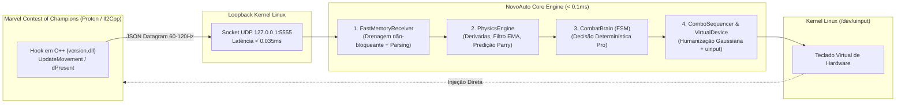

# ⚡ Plano de Implementação: NovoAuto (Zero-Vision MCoC Automation)

> **Status:** Proposta Técnica & Plano de Engenharia  
> **Diretório Alvo:** `/home/erickloyola/novoauto`  
> **Paradigma:** *Zero-Vision Architecture* (Leitura Direta de Memória Il2Cpp + Cinemática de Física Vetorial)  
> **Ambiente de Execução:** Arch Linux / Hyprland / Steam Proton / Kernel Linux (`/dev/uinput`)  

---

## 1. 🔍 Diagnóstico do Estado Atual de `./novoauto`

A análise detalhada do diretório `/home/erickloyola/novoauto` revelou o seguinte cenário:

### 1.1. Arquivos Existentes
* `README.md` (269 linhas): Manifesto do projeto, comparativo de ganhos contra visão computacional (~200x menor latência, 98% menos CPU), descrição do hook de física e árvore de diretórios proposta.
* `DATAGRAMA_UDP.md` (480 linhas): Especificação técnica exaustiva do protocolo UDP (`127.0.0.1:5555`), dicionário de campos, IDs de animação Il2Cpp e padrão de receptor não-bloqueante.
* `MODULO_CINEMATICA_FISICA.md` (469 linhas): Formulação matemática das derivadas cinemáticas ($V_{\text{opp}}, V_{\text{rel}}, A_{\text{opp}}$), preditor temporal de impacto de hitbox ($t_{\text{impacto}}$), zonas espaciais (Zonas 0 a 3) e filtro EMA ($\alpha = 0.75$).
* `CEREBRO_TATICO_COMBAT_BRAIN.md` (503 linhas): Especificação da FSM via `transitions`, matriz de decisão reativa de 7 regras determinísticas (Parry cirúrgico, anti-suicídio em especiais com defesa sustentada por 1.2s, quebra-guarda, anti-SP3, guarda de emergência e cooldown pós-combo de 0.70s).
* `estudo_movimentos_mcoc.md` (140 linhas): Estudo aprofundado das mecânicas do jogo (M-L-L-L-M, cancelamento em especial, strikers/relíquias e debuffs).
* `comandoinput.jpeg` (116 KB): **Layout oficial de comandos do MCoC PC (Steam)**.

### 1.2. O que Falta Desenvolver?
O diretório contém **100% das especificações técnicas, matemáticas e teóricas**, mas **0% do código executável implementado**. Não existem ainda os arquivos `.py`, configurações, scripts de execução, testes ou módulos de kernel.

### 1.3. Descobertas Forenses Críticas (Integração `BlizzMod` vs `NovoAuto`)
Ao inspecionar o código do mod C++ existente em `/home/erickloyola/BlizzMod/libraries/pipeline/telemetry/TelemetryServer.cpp`, constatou-se que o payload gerado atualmente no jogo possui estrutura **plana/híbrida**:
```json
{
  "in_fight": true,
  "player_hp_pct": 100.0,
  "opponent_hp_pct": 100.0,
  "player_mana": 0.0,
  "opponent_mana": 0.0,
  "distance": 2.85,
  "player_pos": {"x": -2.1, "y": 0.0, "z": 0.0},
  "opponent_pos": {"x": 0.75, "y": 0.0, "z": 0.0},
  "is_opponent_blocking": false,
  "is_opponent_stunned": false,
  "player_state": {"id": 0, "name": "Idle"},
  "opponent_state": {"id": 0, "name": "Idle"}
}
```
Enquanto o documento `DATAGRAMA_UDP.md` desenha um modelo **aninhado** (`player: {hp_pct, mana...}`).

> [!IMPORTANT]
> **Decisão de Engenharia #1 (Compatibilidade Imediata):**
> O módulo `telemetry_schema.py` e o `memory_receiver.py` serão construídos com **suporte dual**: eles normalizam automaticamente tanto o formato plano do `BlizzMod` já compilado quanto o formato aninhado futuro, permitindo que o `NovoAuto` funcione imediatamente com o jogo sem necessidade de recompilar a `version.dll`.

### 1.4. Mapeamento Real dos Comandos (`comandoinput.jpeg`)
A inspeção da imagem `comandoinput.jpeg` valida o esquema padrão de teclado do MCoC na Steam:
* **`W` ou `↑`**: Ataque Leve (toque rápido) / Ataque Pesado (segurar e soltar)
* **`D` ou `→`**: Ataque Médio / Dash para Frente
* **`A` ou `←`**: Esquivar / Dash para Trás / Destreza
* **`S` ou `↓`**: Bloqueio / Aparar (Parry)
* **`Espaço` ou `Ctrl`**: Ataque Especial (SP1, SP2, SP3)
* **`Shift`**: Assistência (Striker / Relíquia)

---

## 2. 🏛️ Arquitetura do Sistema NovoAuto

O sistema opera como uma cadeia linear de baixíssima latência ($< 0.1\text{ms}$ por ciclo):



---

## 3. 🗺️ Fases do Plano de Implementação

### Fase 1: Fundação, Esquema e Receptor UDP Resiliente
*Objetivo: Estabelecer a base de tipos, configurações e a ingestão de telemetria sem bloqueio.*

- [ ] **1.1. Configuração Central (`config.py` e `timings.json`)**
  - Mapeamento de portas UDP (`127.0.0.1:5555`).
  - Mapeamento oficial de teclas para os esquemas `WASD` e `ARROWS` conforme `comandoinput.jpeg`.
  - Calibração de tempos e jitters em `timings.json` (Parry: 120ms, Heavy: 480ms, Light: 55ms, Dash: 80ms).
- [ ] **1.2. Dataclasses de Telemetria com Suporte Dual (`core/telemetry_schema.py`)**
  - Dataclasses tipadas com `slots=True`: `Vector3`, `CombatantState`, `TelemetryPacket`.
  - Parser polimórfico capaz de deserializar tanto o payload do `BlizzMod` em produção quanto o formato expandido de `DATAGRAMA_UDP.md`.
- [ ] **1.3. Receptor UDP Não-Bloqueante (`capture/memory_receiver.py`)**
  - Socket UDP com `setblocking(False)` e tamanho de buffer de 64KB.
  - Método `poll_latest_packet()` que drena a fila do kernel e retorna estritamente o pacote mais recente (eliminação total de Head-of-Line Blocking).
  - Suporte inteligente a parser C/Rust (`orjson`) com fallback transparente para `json` nativo.
  - Watchdog de liveness (1.5s sem sinal = `in_fight = False`).
- [ ] **1.4. Dependências (`requirements.txt`)**
  - Declaração de `evdev`, `transitions`, `rich` e opcionalmente `orjson`.

---

### Fase 2: Motor de Cinemática e Predição de Colisão Física
*Objetivo: Substituir todo o processamento de imagens por derivadas matemáticas escalares.*

- [ ] **2.1. Cinemática e Derivadas (`physics/kinematics.py`)**
  - Cálculo de $\Delta t$, distâncias longitudinal ($d_X$) e euclidiana 3D ($d_{3D}$).
  - Derivadas de 1ª ordem ($V_{\text{player}}, V_{\text{opp}}, V_{\text{rel}}$) e 2ª ordem ($A_{\text{opp}}$).
  - Filtro de Média Móvel Exponencial (EMA) com $\alpha = 0.75$ para supressão de ruído mecânico do motor Unity.
  - Detecção e compensação automática de inversão de lado no ringue (`is_side_inverted`).
  - Zonificação espacial de combate em 4 zonas:
    - Zona 0: Corpo a Corpo ($d_X \le 1.6\text{m}$)
    - Zona 1: Alcance de Dash ($1.6\text{m} < d_X \le 2.8\text{m}$)
    - Zona 2: Baiting ($2.8\text{m} < d_X \le 4.0\text{m}$)
    - Zona 3: Longa / Neutro ($d_X > 4.0\text{m}$)
- [ ] **2.2. Preditor Temporal de Colisão (`physics/collision_predictor.py`)**
  - Cálculo contínuo do tempo até contato de hitbox: $t_{\text{impacto}} = \frac{d_X - d_{\text{contato}}}{|V_{\text{rel}}|}$.
  - Janela cirúrgica calibrada para Aparar (Parry ótimo entre $90\text{ms}$ e $135\text{ms}$).
- [ ] **2.3. Testes Unitários de Física (`tests/test_kinematics.py` e `tests/test_collision.py`)**
  - Testes com vetores de aceleração simulada, aproximação violenta de Dash e recuo.

---

### Fase 3: Emulador de Periférico e Sequenciador de Combos
*Objetivo: Interagir com o kernel Linux via `/dev/uinput` e encadear combos perfeitos.*

- [ ] **3.1. Dispositivo Virtual no Kernel (`execution/virtual_device.py`)**
  - Criação de dispositivo de entrada virtual via `evdev.UInput`.
  - Fallback automático para modo `dry-run` simulado caso o usuário não tenha permissão de escrita em `/dev/uinput`.
  - Suporte à inversão de direção (quando o jogador e oponente trocam de lado no ringue).
  - Parada de emergência (`emergency_stop()`) e liberação total de teclas (`release_all()`).
- [ ] **3.2. Humanizador Estocástico Biológico (`execution/humanizer.py`)**
  - Gerador de micro-jitter gaussiano ($\mu, \sigma$) com limites seguros contra detecção anti-cheat.
- [ ] **3.3. Sequenciador de Combo Rítmico (`execution/combo_sequencer.py`)**
  - Execução universal de 5 acertos: `M -> L -> L -> L -> M`.
  - Resolução do problema de "Double-Dash": avanço integrado de golpe médio.
  - Cancelamento no 5º golpe em Ataque Especial (SP1 / SP2).
  - Extensão de combo com Relíquia/Striker (`Shift`).
  - Variação com finalizador em Ataque Pesado (`M-L-L-L-H`).
- [ ] **3.4. Testes de Input (`tests/test_virtual_device.py`)**
  - Validação de emissão de eventos em modo simulado.

---

### Fase 4: Cérebro Tático Determinístico (CombatBrain FSM & Playbook)
*Objetivo: Implementar a máquina de estados reativa com as 7 regras determinísticas do MCoC.*

- [ ] **4.1. Máquina de Estados Finita (`brain/combat_fsm.py`)**
  - FSM formal com 9 estados: `PAUSA_SEGURA`, `NEUTRO`, `DEFESA_PARRY`, `DEFESA_ESPECIAL`, `ESQUIVA_PESADO`, `QUEBRA_GUARDA`, `BAITING_SP`, `JANELA_DE_PUNICAO`, `EXECUTANDO_COMBO`.
- [ ] **4.2. Matriz de Decisão Reativa (`brain/rules.py`)**
  - **Regra 1 (Aparar Preditivo):** Pulso de bloqueio cirúrgico de 120ms ao detectar colisão iminente com confirmação de atordoamento.
  - **Regra 2 (Defesa Ativa contra Especiais):** Destreza com recuo duplo e bloqueio sustentado por 1.2s até confirmação de `Recovery` (`state_id in (6, 8, 10)`), impedindo mortes por projéteis secundários.
  - **Regra 3 (Quebra-Guarda com Pesado):** Detecção de oponente em bloqueio contínuo e quebra de guarda na Zona 0 ou com aproximação na Zona 1.
  - **Regra 4 (Baiting Preventivo Anti-SP3):** Fintas e toques de guarda na Zona 2 quando $opp\_mana \ge 2.80$.
  - **Regra 5 (Guarda de Emergência):** Travamento defensivo de 420ms após queda de vida súbita ($\Delta\text{HP} \ge 1.8\%$) para absorver combos da IA.
  - **Regra 6 (Disciplina Pós-Combo / Wake-up):** Janela de cooldown estrito de 0.70s pós-combo para evitar "socos no ar" e interceptações.
  - **Regra 7 (Iniciativa de Neutro):** Abertura de guarda e aproximação rápida com Dash Médio se a IA ficar passiva.
- [ ] **4.3. Testes Unitários de FSM (`tests/test_combat_fsm.py`)**
  - Simulação de cada transição de estado da tabela da verdade.

---

### Fase 5: Pipeline Central, CLI e Dashboard Terminal (TUI)
*Objetivo: Integrar todos os subsistemas em um executável coeso e de fácil monitoramento.*

- [ ] **5.1. Loop Principal Ultrarrápido (`core/pipeline.py`)**
  - Loop assíncrono com medição precisa de latência por iteração.
- [ ] **5.2. Ponto de Entrada CLI (`main.py`)**
  - Subcomandos:
    - `run`: Executa o bot em background/terminal.
    - `monitor`: Inicia o dashboard interativo de terminal com Rich.
    - `sim`: Simula combates a partir de arquivos de telemetria gravados ou sintéticos.
    - `benchmark`: Mede a latência fim a fim das derivadas e do cérebro.
    - `test`: Executa a suíte de testes unitários.
- [ ] **5.3. Dashboard de Terminal Rich (`ui/terminal_monitor.py`)**
  - Exibição de HUD em tempo real: barras de HP e Mana, distância 3D, velocidades, ação classificada, estado da FSM e latência de loop (em microssegundos).
- [ ] **5.4. Script de Atalho Global Hyprland (`toggle.sh`)**
  - Script para ligar/desligar a automação via atalho de teclado global (**F10**) com notificações desktop via `notify-send`.

---

### Fase 6: Validação, Benchmarks e Teste no Jogo
*Objetivo: Homologação no ambiente real Arch Linux / Proton.*

- [ ] **6.1. Execução Completa dos Testes Automatizados**
  - Meta: 100% de testes unitários passando em menos de 2 segundos.
- [ ] **6.2. Benchmark de Performance**
  - Validar latência total do ciclo de decisão $< 0.1\text{ms}$.
  - Validar consumo de CPU $< 1.0\%$.
- [ ] **6.3. Verificação em Luta Real no MCoC**
  - Testar Parry preditivo, quebra de guarda e defesa contra especiais de múltiplos hits.

---

## 4. 📂 Estrutura de Arquivos a ser Construída

```
novoauto/
├── config.py                 # Mapeamento de portas UDP, esquemas WASD/Arrows (comandoinput.jpeg)
├── timings.json              # Calibrações milissegundo e jitters humanizados
├── requirements.txt          # evdev, transitions, rich, orjson
├── main.py                   # Ponto de entrada CLI (run, monitor, sim, benchmark, test)
├── toggle.sh                 # Alternador de execução com notify-send e atalho F10
│
├── core/
│   ├── __init__.py
│   ├── pipeline.py           # Loop reativo assíncrono de alto desempenho
│   └── telemetry_schema.py   # Dataclasses com suporte dual (BlizzMod atual + Expandido)
│
├── capture/
│   ├── __init__.py
│   └── memory_receiver.py    # Receptor UDP não-bloqueante com buffer drain
│
├── physics/
│   ├── __init__.py
│   ├── kinematics.py         # Derivadas cinemáticas, filtro EMA, zonas e inversão de lado
│   └── collision_predictor.py# Preditor de tempo até colisão de hitbox para Parry
│
├── brain/
│   ├── __init__.py
│   ├── combat_fsm.py         # FSM formal com 9 estados baseada em transitions
│   └── rules.py              # Matriz de regras MCoC Pro (7 regras essenciais)
│
├── execution/
│   ├── __init__.py
│   ├── virtual_device.py     # Emulador uinput no kernel com modo dry-run
│   ├── combo_sequencer.py    # Cadeia M-L-L-L-M, cancelamento em SP e Striker
│   └── humanizer.py          # Micro-jitter biológico estocástico
│
├── ui/
│   ├── __init__.py
│   └── terminal_monitor.py   # Dashboard visual TUI em tempo real via Rich Live
│
└── tests/
    ├── __init__.py
    ├── test_kinematics.py    # Testes das equações físicas e velocidades
    ├── test_collision.py     # Testes da predição temporal de Parry
    ├── test_combat_fsm.py    # Testes das transições da máquina de estados
    └── test_virtual_device.py# Testes de injeção de teclas e parada de emergência
```

---

## 5. 🛡️ Tabela de Riscos e Mitigações

| Risco Identificado | Gravidade | Mitigação Técnica Planejada |
| :--- | :---: | :--- |
| **Discrepância no formato UDP entre `BlizzMod` e `DATAGRAMA_UDP.md`** | **Alta** | O `telemetry_schema.py` detectará as chaves e normalizará os campos independentemente de virem no formato plano do `BlizzMod` ou aninhados, funcionando de imediato sem recompilar o jogo. |
| **Falta de permissão de escrita em `/dev/uinput`** | **Média** | `virtual_device.py` detectará erro de permissão e ativará automaticamente o modo simulado (`dry_run = True`), alertando o usuário sobre a regra udev necessária (`/etc/udev/rules.d/99-uinput.rules`). |
| **Ausência de `orjson` no ambiente Python 3.14** | **Baixa** | Fallback condicional para `json` nativo com `errors="ignore"`, garantindo inicialização limpa em qualquer Python. |
| **Inversão de Lado no Ringue (Campeões trocam de lado)** | **Média** | `PhysicsEngine` calcula `is_side_inverted = player_x > opp_x` e o `VirtualDevice` inverte os comandos direcionais dinamicamente. |
| **Travamento por falta de pacotes (ex: loading, KO ou crash)** | **Baixa** | Watchdog de 1.5s no `memory_receiver.py` desarma as teclas (`emergency_stop()`) e coloca a FSM em `PAUSA_SEGURA`. |
