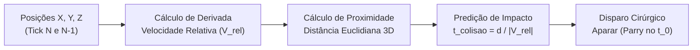
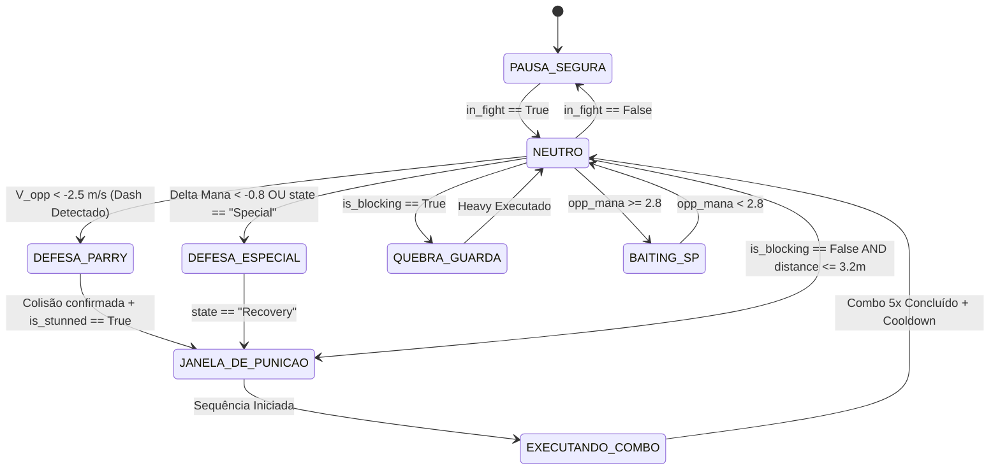

#  NovoAuto - Arquitetura de Automação Baseada no Hook de Física e Memória RAM

> **Projeto:** NovoAuto (Next-Gen MCoC Bot)  
> **Paradigma:** *Zero-Vision Architecture* (100% Baseado em Leitura Direta de Memória e Cinemática de Física em Tempo Real)  
> **Alvo:** Marvel Torneio de Campeões (MCoC) via Steam / Proton / Linux (Arch / Hyprland / Wayland)  

---

## 1.  Visão Geral e Manifesto do Projeto

O **NovoAuto** é a evolução arquitetural definitiva do AutoJG. Ele elimina **100% da camada de visão computacional** (OpenCV, OCR, segmentação HSV, fluxo óptico, captura de tela via `grim`/`mss`), substituindo-a inteiramente pela ingestão determinística e em tempo real dos dados extraídos diretamente do **Hook de Física e Animação do motor Unity/Il2Cpp** (`UltimatePlayerController_UpdateMovement`).

### 1.1. Por que eliminar a Visão Computacional?

| Aspecto | AutoJG Anterior (Visão + Mod) | NovoAuto (Zero-Vision / Pure Physics) | Ganho Real |
| :--- | :--- | :--- | :--- |
| **Latência de Percepção** | 15ms a 30ms (captura + decodificação + filtros) | **< 0.1ms** (datagrama UDP local direto da RAM) | **~200x mais rápido** |
| **Consumo de CPU** | 40% a 70% (captura contínua de tela e OpenCV) | **< 1.0%** (leitura assíncrona de socket) | **Economia de 98% de CPU** |
| **Consumo de GPU** | Alto (cálculo de fluxo óptico e renderização) | **0%** (processamento puramente escalar) | **Zero impacto gráfico** |
| **Confiabilidade da Leitura** | Heurística (ruídos de fumaça, luz, cenários) | **100% Determinística** (flags binárias da RAM) | **Zero falsos positivos** |
| **Dependência de Janela** | Requer foco, resolução fixa (1440x900) e Wayland | **Totalmente agnóstico** (funciona minimizado) | **Independência visual** |
| **Stack de Dependências** | Pesado (`opencv`, `mss`, `Pillow`, `cairocffi`) | **Ultraleve** (`evdev`, `transitions`, `orjson`) | **Instalação em segundos** |

---

## 2. 🔬 O Hook de Física em Tempo Real (`UpdateMovement`)

No mod injetado no jogo (`version.dll` compilado via MSVC/Wine), o hook é posicionado no método interno do motor Unity:
```cpp
UltimatePlayerController_UpdateMovement(UltimatePlayerController* this, float deltaTime)
```

Este método é executado pelo motor de física e animação do jogo a cada tick (**60 FPS a 120 FPS fixos**) para ambos os lutadores simultaneamente, contendo os ponteiros mais puros de estado cinemático e mecânico.

### 2.1. Payload Transmitido via UDP (`127.0.0.1:5555`)

O hook empacota e envia um datagrama JSON compacto a cada ciclo:

```json
{
  "timestamp_ms": 1726001234567,
  "in_fight": true,
  "distance": 2.45,
  "player": {
    "pos": {"x": -1.80, "y": 0.0, "z": 0.0},
    "hp_pct": 100.0,
    "mana": 1.45,
    "power_bars": 1,
    "state_id": 1,
    "state_name": "Idle",
    "is_blocking": false,
    "is_stunned": false
  },
  "opponent": {
    "pos": {"x": 0.65, "y": 0.0, "z": 0.0},
    "hp_pct": 88.5,
    "mana": 0.90,
    "power_bars": 0,
    "state_id": 5,
    "state_name": "Run",
    "is_blocking": false,
    "is_stunned": false,
    "blocks_requested_flags": 0
  }
}
```

>  **Documentação Aprofundada:** Para a especificação exaustiva de cada campo, mapeamento de todos os `state_id`, payloads de exemplo em combate real e código de referência do receptor assíncrono em Python, consulte [DATAGRAMA_UDP.md](./DATAGRAMA_UDP.md).

---

## 3.  Módulo de Cinemática e Física Preditiva (`PhysicsEngine`)

Em vez de deduzir o que o oponente está fazendo a partir de mudanças de cores de pixels, o **NovoAuto** utiliza fórmulas cinemáticas elementares da física clássica.



### 3.1. Equações Cinemáticas em Tempo Real

1. **Velocidade Relativa no Eixo do Ringue ($V_{\text{rel}}$):**
   $$\Delta X_{\text{opp}} = X_{\text{opp}}(t) - X_{\text{opp}}(t - \Delta t)$$
   $$V_{\text{opp}} = \frac{\Delta X_{\text{opp}}}{\Delta t}$$
   $$V_{\text{rel}} = V_{\text{opp}} - V_{\text{player}}$$

2. **Detecção Instantânea de Dash Inimigo por Física:**
   * Se $V_{\text{opp}} < -2.5\text{ m/s}$ (o oponente está se deslocando violentamente para a esquerda, em direção ao jogador):
     $$\text{Ação} = \text{DASH\_FORWARD}$$

3. **Predição do Ponto de Impacto (Frame-Perfect Parry Timing):**
   * Com a distância atual $d$ e a velocidade de aproximação $V_{\text{rel}}$:
     $$t_{\text{impacto}} = \frac{d - d_{\text{colisao}}}{|V_{\text{rel}}|}$$
   * Quando $t_{\text{impacto}} \le 120\text{ ms}$, o bot aciona o comando de Bloqueio (`S` / `↓`).
   * **Resultado:** O Aparar (Parry) ocorre exatamente no milissegundo de contato da hitbox, garantindo 100% de consistência sem depender de atraso visual.

4. **Zonificação de Combate (Range Zones):**
   * **Corpo a Corpo ($d < 2.0\text{m}$):** Alcance de golpes leves, médios e ataque pesado.
   * **Média Distância ($2.0\text{m} \le d \le 3.5\text{m}$):** Alcance de avanço com Dash Médio.
>  **Documentação Aprofundada:** Para a formulação matemática completa, diagramas de zonificação (Zonas 0 a 3), filtro EMA, proteção contra inversão de lado e código fonte Python de alta performance (`PhysicsEngine`), consulte [MODULO_CINEMATICA_FISICA.md](./MODULO_CINEMATICA_FISICA.md).

---

## 4.  Cérebro Tático Determinístico (`CombatBrain`)

Como os dados da memória são livres de ruído, a Máquina de Estados Finita (FSM) opera de forma **100% determinística**, sem necessidade de filtros de média móvel, janelas de tolerância ou thresholds de probabilidade.



### 4.1. Regras de Decisão Instantânea

1. **Avanço Inimigo (Dash Forward):**
   * *Condição:* $V_{\text{opp}} \le -2.5\text{ m/s}$ OU `state_name == "Run"`.
   * *Ação:* Pulso de bloqueio imediato (Parry de 120ms). Ao atordoar (`is_opponent_stunned == True`), transita para `JANELA_DE_PUNICAO`.
2. **Disparo de Especial (SP1/SP2):**
   * *Condição:* Queda brusca de mana ($\Delta \text{Mana} \le -0.8$) OU `state_name == "Special"`.
   * *Ação:* Destreza imediata (`double_dash_back()`), guarda firme (`engage_block()`) com sustentação por 1.2s até o oponente entrar em recuperação (`state_name == "Idle"` / `"Recovery"`), garantindo punição sem ser atingido por projéteis.
3. **Oponente Bloqueando:**
   * *Condição:* `opponent.is_blocking == True`.
   * *Ação:* Se $d < 2.0\text{m}$, carrega Ataque Pesado (`hold_heavy()`). Se $d \ge 2.0\text{m}$, avança com Dash Médio e quebra a guarda.
4. **Oponente em Guarda Aberta:**
   * *Condição:* `opponent.is_blocking == False` e `in_fight == True`.
   * *Ação:* Inicia combo `M-L-L-L-M` com avanço único, cancelando no Ataque Especial no 5º golpe.
5. **Risco Crítico de SP3:**
   * *Condição:* `opponent.mana >= 2.8`.
   * *Ação:* Entra em `BAITING_SP`, mantendo espaçamento seguro ($d > 3.0\text{m}$) e alternando fintas para forçar a IA a gastar barras antes de atingir o nível 3.

>  **Documentação Aprofundada:** Para a máquina de estados completa (FSM transitions), tabela da verdade de todas as combinações de combate, regras anti-suicídio de especiais, disciplina pós-combo e código fonte Python (`CombatBrain`), consulte [CEREBRO_TATICO_COMBAT_BRAIN.md](./CEREBRO_TATICO_COMBAT_BRAIN.md).

---

## 5. 📂 Estrutura Proposta de Diretórios (`novoauto`)

A estrutura do projeto é limpa, modular e desprovida de qualquer módulo ou biblioteca gráfica:

```
novoauto/
├── config.py                 # Configurações de rede UDP, portas e mapeamento de teclas
├── timings.json              # Parâmetros temporais humanizados (ms) e fatores de jitter
├── requirements.txt          # Dependências mínimas (apenas 4 pacotes leves)
├── main.py                   # Ponto de entrada CLI (start, sim, benchmark, monitor)
├── toggle.sh                 # Script de ativação/pausa com atalho de teclado global (F10)
│
├── core/                     # Motor Central
│   ├── __init__.py
│   ├── pipeline.py           # Loop reativo assíncrono (< 1ms por iteração)
│   └── telemetry_schema.py   # Dataclasses tipadas do payload de memória
│
├── capture/                  # Ingestão de Memória / Rede
│   ├── __init__.py
│   └── memory_receiver.py    # Receptor assíncrono UDP (127.0.0.1:5555)
│
├── physics/                  # Motor de Física e Cinemática
│   ├── __init__.py
│   ├── kinematics.py         # Cálculo de velocidades, acelerações e distâncias 3D
│   └── collision_predictor.py# Preditor temporal de impacto de hitbox
│
├── brain/                    # Inteligência Tática e Tomada de Decisão
│   ├── __init__.py
│   ├── combat_fsm.py         # Máquina de estados baseada em transitions
│   └── rules.py              # Regras táticas determinísticas do playbook MCoC
│
├── execution/                # Emulação de Hardware e Sequenciamento
│   ├── __init__.py
│   ├── virtual_device.py     # Emulador de teclado no Linux (/dev/uinput via evdev)
│   ├── combo_sequencer.py    # Encadeador de golpes (M-L-L-L-M, cancelamento e striker)
│   └── humanizer.py          # Micro-jitter biológico gaussiano anti-cheat
│
├── ui/                       # Interface de Monitoramento Leve (Terminal / TUI)
│   ├── __init__.py
│   └── terminal_monitor.py   # Dashboard em tempo real no terminal via Rich (sem GTK)
│
└── tests/                    # Suíte de Testes Unitários e Mock
    ├── __init__.py
    ├── test_kinematics.py    # Validação dos cálculos físicos e de velocidade
    ├── test_collision.py     # Validação das predições de parry
    ├── test_combat_fsm.py    # Teste de transições de estado
    └── test_virtual_device.py# Teste de emissão de teclas uinput
```

---

## 6. 📦 Dependências e Stack de Tecnologias

Diferente do projeto anterior, o **NovoAuto** não requer compilação de bibliotecas pesadas de visão ou janelas X11/Wayland:

### `requirements.txt`
```txt
evdev>=1.7.0          # Emulação de periférico virtual no kernel Linux (/dev/uinput)
transitions>=0.9.0    # Motor formal de Máquina de Estados Finitos (FSM)
rich>=13.7.0          # Dashboard visual elegante de terminal (TUI)
orjson>=3.9.0         # Parser ultrarrápido de JSON em C/Rust para o socket UDP
```

> **Nota:** Não há dependência de `opencv-python`, `mss`, `Pillow`, `numpy`, `PyGObject` ou servidores gráficos. O script roda diretamente no terminal com latência mínima e altíssimo desempenho.

---

## 7. ⌨️ Mapeamento de Teclas e Emulação no Kernel (`/dev/uinput`)

O módulo `VirtualDevice` registra um teclado virtual de hardware no kernel do Linux:

* **Esquema Padrão (WASD / Gamer):**
  * `D` / `→`: Golpe Médio / Avançar com Dash
  * `J`: Golpe Leve (Tocar)
  * `K`: Golpe Pesado (Carregar e Soltar)
  * `S` / `↓`: Bloqueio / Aparar (Parry)
  * `A` / `←`: Recuo / Esquiva (Dash Back)
  * `W`: Ativação de Ataque Especial (SP1 / SP2)
  * `L`: Ativação da Relíquia / Striker
* **Humanização Biológica Anti-Cheat:**
  * Variação estocástica gaussiana nos tempos de toque ($\mu = 40\text{ms}, \sigma = 6\text{ms}$).
  * Intervalos irregulares entre golpes leves ($\mu = 110\text{ms}, \sigma = 12\text{ms}$).
  * Impossibilidade de detecção por padrões matemáticos constantes.

