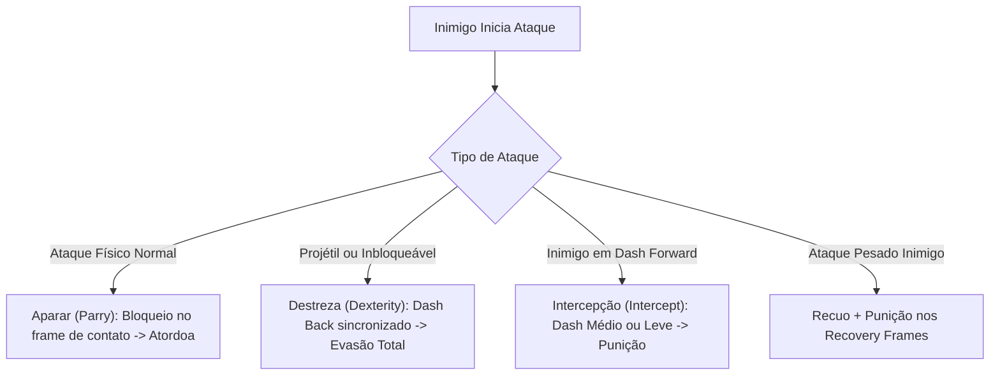

# Estudo Completo de Movimentos e Mecânicas: Marvel Torneio de Campeões (MCoC)

Este estudo detalha a estrutura de movimentação, mecânicas reativas de combate e o gerenciamento de habilidades em **Marvel Contest of Champions (MCoC)**.

---

## 1. Movimentos Básicos e Estrutura de Combos

O combate em MCoC é baseado em um sistema de 2D fighting com controle simplificado de alta precisão (toques, deslizes e retenções).

### 1.1. Tipos de Golpes Básicos
* **Ataque Leve (Light - L):**
  * *Execução:* Toque rápido no lado direito da tela (ou tecla correspondente).
  * *Características:* Dano baixo, altíssima velocidade de saída (*startup*) e recuperação rápida. Essencial para manter o adversário preso na cadeia de golpes.
* **Ataque Médio (Medium - M):**
  * *Execução:* Deslizar para a direita (Dash para frente).
  * *Características:* Dano intermediário, alcance maior. Usado como abertura de combo (*dash-in*) e como finalizador de combo.
* **Ataque Pesado (Heavy - H):**
  * *Execução:* Pressionar e segurar o lado direito, soltando em seguida.
  * *Características:* Possui um longo tempo de preparação (*wind-up*), mas **quebra a defesa comum** do oponente (*Block Break*). Causa alto dano ou múltiplos acertos e frequentemente aplica debuffs ou buffs específicos do campeão.

### 1.2. Ações Defensivas Básicas
* **Bloqueio Comum (Block):** Pressionar e segurar o lado esquerdo. Reduz substancialmente o dano direto, mas ainda causa dano residual (*block proficiency*) e pode ser quebrado por ataques pesados ou ataques inbloqueáveis.
* **Recuo / Esquiva Simples (Dash Back):** Deslizar para a esquerda. Move o campeão para trás, criando espaçamento.

### 1.3. Cadeia de Combo Padrão (M-L-L-L-M)
* A combinação universal mais eficiente do jogo consiste em **5 acertos**:
  $$\text{Médio (Dash)} \rightarrow \text{Leve} \rightarrow \text{Leve} \rightarrow \text{Leve} \rightarrow \text{Médio}$$
* **Por que essa ordem?**
  1. O primeiro **Médio** fecha a distância com rapidez.
  2. Os três **Leves** maximizam o número de acertos sem dar tempo de recuperação à IA.
  3. O segundo **Médio** finaliza a sequência empurrando o oponente para longe e permitindo conexão segura com um **Ataque Especial**.
* **Variação M-L-L-L-H:** Finalizar com golpe pesado (útil quando o campeão precisa aplicar um efeito do pesado logo após o combo, comum com campeões que atordoam no último golpe ou na parede).

---

## 2. Movimentos e Mecânicas Reativas (Timing & Frame Advantage)

Estas são as mecânicas avançadas que definem o nível de domínio do jogo e exigem precisão de milissegundos.

---

### 2.1. Aparar (Parry) - Maestria Essencial
* **Conceito:** Bloquear no instante exato em que o ataque do oponente vai atingir seu campeão.
* **Efeito:** Anula quase todo o dano do golpe e aplica um **Atordoamento (Stun)** temporário no adversário.
* **Janela de Ação:** Requer sincronismo na janela de impacto (cerca de 2 a 5 frames antes do golpe conectar).
* **Limitações:**
  * Não atordoa oponentes imunes a atordoamento (*Stun Immune*).
  * Golpes sem contato físico direto (como rajadas de energia, lasers e projéteis da maioria dos campeões) não ativam o atordoamento do Parry, apenas reduzem dano.

### 2.2. Destreza (Dexterity) - Evasão Ativa
* **Conceito:** Deslizar para trás no momento exato em que um golpe (básico ou especial) está prestes a conectar.
* **Efeito:**
  * O campeão esquiva totalmente do golpe, recebendo **0 de dano**.
  * Concede um buff passivo de **Precisão Crítica (Precision)** para o próximo golpe do jogador.
* **Uso Primário:** Essencial para desviar de Ataques Especiais multihits (ex: desviar de múltiplos projéteis ou raios em sequência).

### 2.3. Intercepção (Intercepting)
Técnica ofensivo-reativa de alto nível que consiste em atacar o adversário enquanto ele está vindo em sua direção, interrompendo o ataque dele antes que ele conecte:
1. **Medium Intercept (Dash Intercept):**
   * Quando a IA inicia um dash para frente, o jogador também dá um dash para frente com ataque médio. O primeiro a registrar o alcance com frame favorável vence a troca.
2. **Backdraft Intercept:**
   * O jogador finaliza 4 hits do combo (M-L-L-L), dá um recuo imediato (Dash Back) e, no milissegundo em que o adversário avança para punir, o jogador avança de volta com um Médio ou Leve, interceptando a IA no vácuo.
3. **Importância:** Fundamental contra oponentes com *Insuperável (Unstoppable)* ou quando o Parry está desativado pelo nó da missão.

### 2.4. Isca de Especiais (Baiting)
* **Conceito:** Manipular o comportamento da IA para forçá-la a gastar a barra de poder antes de acumular 3 barras.
* **Mecânica:** Ficar a meia distância, intercalando pequenos bloqueios e recuos (*spacing*), deixando uma falsa abertura para que a IA decida disparar o SP1 ou SP2, que podem ser desviados com Destreza.

---

## 3. Uso de Habilidades, Poder e Recursos Especiais

### 3.1. Ataques Especiais (SP1, SP2 e SP3)
A energia é acumulada ao acertar golpes, receber golpes e por efeitos de campeões:

| Nível | Custo | Características | Aplicação Estratégica |
| :--- | :--- | :--- | :--- |
| **SP1 (Especial 1)** | 1 Barra | Rápido, custo baixo. | Aplicação frequente de debuffs utilitários (ex: sangramento, choque, redução de cura). |
| **SP2 (Especial 2)** | 2 Barras | Maior multiplicador de dano em quase todos os campeões. | Finalizador principal de lutas e ativação de buffs pesados (Fúria, Crueldade). |
| **SP3 (Especial 3)** | 3 Barras | **Indesviável e Cinematográfico**. Não pode ser bloqueado ou evadido por meios comuns. | Usado quando se quer dano garantido sem risco de erro, ou para aplicar efeitos permanentes do kit do personagem. |

* **Regra de Conexão (Cancel Combo):** O melhor momento para soltar o SP1 ou SP2 é imediatamente após o último golpe de um combo (M-L-L-L-M $\rightarrow$ Ativar Especial), cancelando a animação de recuperação e garantindo que o golpe acerte antes que o adversário consiga bloquear.

---

### 3.2. Relíquias e Apoiadores (Strikers)
Introduzidas como expansão do sistema de combate:
* **Invocação do Striker:** Botão dedicado na tela. Invoca o campeão associado à relíquia para desferir um combo rápido de 2 a 3 golpes.
* **Extensão de Combo (Combo Extender):** Permite encadear uma nova rotação de golpes sem que o oponente caia no chão:
  $$\text{Combo 5 hits} \rightarrow \text{Ativação do Striker} \rightarrow \text{Novo Combo 5 hits} \rightarrow \text{Especial}$$
* **Utilidade:** Permite carregar barras de poder muito mais rápido e aplicar bônus específicos da classe (Cósmico, Mutante, Científico, Habilidade, Místico, Tecnológico).

---

### 3.3. Estados Críticos e Modificadores Reativos

* **Insuperável (Unstoppable):**
  * O campeão não sofre atordoamento nem interrupção ao receber ataques básicos; ele continua batendo através dos seus golpes.
  * *Contramedidas:* Aplicar o debuff de **Lentidão (Slow)** ou **Desacelerar (Decelerate)**, ou manter distância até o cronômetro expirar.
* **Inbloqueável (Unblockable):**
  * Golpes que ignoram completamente a defesa simples.
  * *Contramedidas:* Esquiva absoluta com **Destreza (Dexterity)** ou manter recuo.
* **Esquiva Automática (Evade):**
  * Habilidade passiva de certos defensores (ex: Spider-Man, Quicksilver) de esquivar de ataques sem ação manual.
  * *Contramedidas:* Efeitos de **Golpe Certeiro (True Strike)**, **Precisão Verdadeira (True Accuracy)** ou **Lentidão (Slow)**.
* **Bloqueio Automático (Auto-Block):**
  * Campeões que erguem a defesa automaticamente mesmo quando estão em recuperação ou atacando (ex: Modok, Iron Man IW).
  * *Contramedidas:* **Golpe Certeiro (True Strike)** ou quebra de armadura que desative escudos.
* **Incorpóreo / Falha (Miss / Phase):**
  * Golpes passam direto através do personagem (ex: Ghost, Kitty Pryde).
  * *Contramedidas:* Efeitos de **Vigilância (Vigilance)** ou esperar o encerramento da fase.
* **Enraizado (Root):**
  * O campeão fica preso ao chão, impedido de recuar ou dar dash.

---

## 4. Matriz de Decisão Reativa em Combate

Para sistemas de análise ou tomada de decisão, o fluxo ótimo segue esta matriz:

| Evento do Adversário | Estado do Oponente | Ação Recomendada |
| :--- | :--- | :--- |
| **Início de Dash Forward** | Normal | **Aparar (Parry)** no contato OU **Intercepção** com Médio |
| **Início de Dash Forward** | Insuperável (*Unstoppable*) | **Recuo (Dash Back)**, não tentar Parry |
| **Início de Golpe Pesado (Wind-up)** | Carregando golpe | **Dash Back duplo** $\rightarrow$ Avançar com Médio nos *recovery frames* |
| **Ativação de SP1 / SP2** | Normal / Inbloqueável | **Destreza (Dexterity)** repetida acompanhando cada projétil/hit |
| **Oponente Bloqueando** | Postura estática de defesa | **Ataque Pesado** para quebrar bloqueio OU recuar para atrair (*bait*) |
| **Oponente com 2.8+ Barras de Poder** | Risco iminente de SP3 | **Bait agressivo**: Forçar o gasto do SP2 antes que atinja 3 barras |
